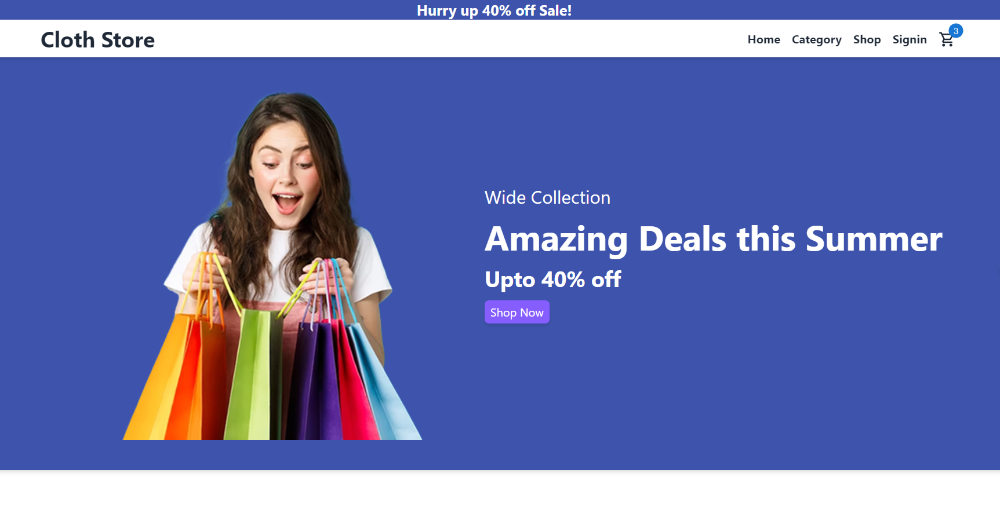

# A awesome Ecommerce App with React Vite, Redux, Tailwindcss & Material-UI
### Full Mobile Responsive App

#### Go to Live Project: https://ecommerce-store-react-redux-tailwind.netlify.app/

<!--  -->

### Full Mobile Responsive Web Page

#### Add image with link in Readme Directory:

### What I use here:
* React
* Redux
* Tailwindcss
* Material-UI
* material-Icons
